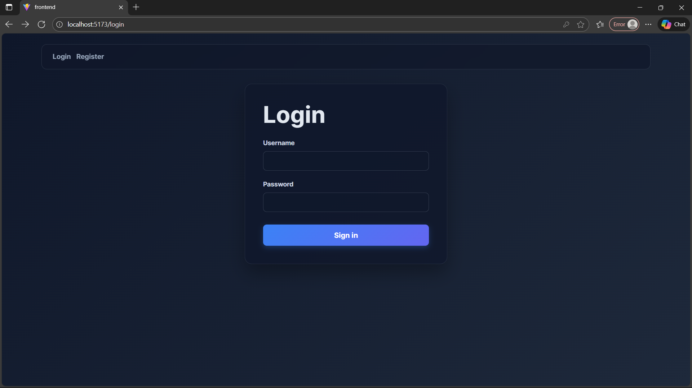
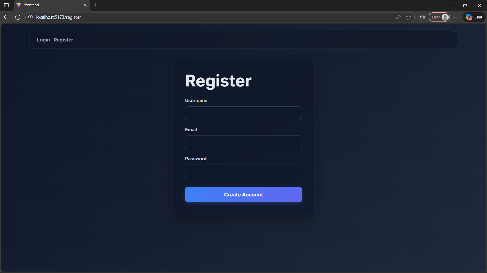
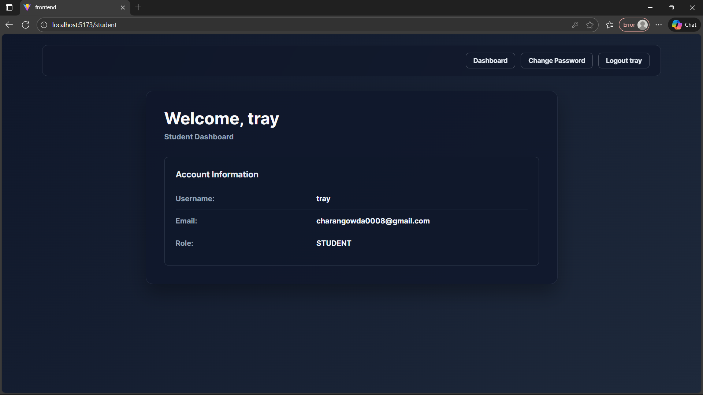
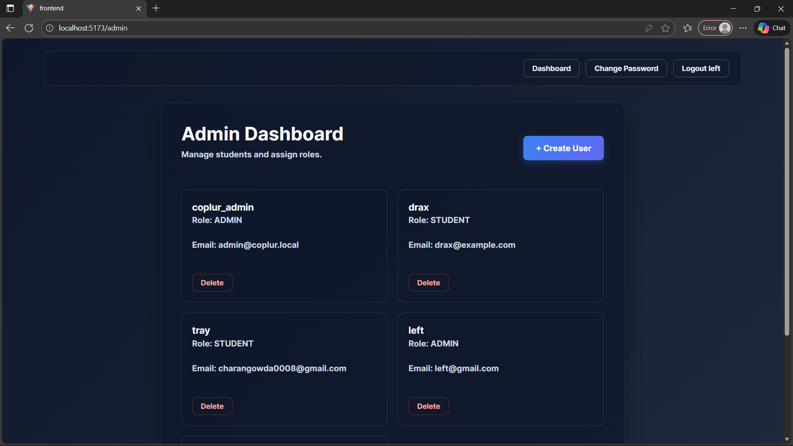
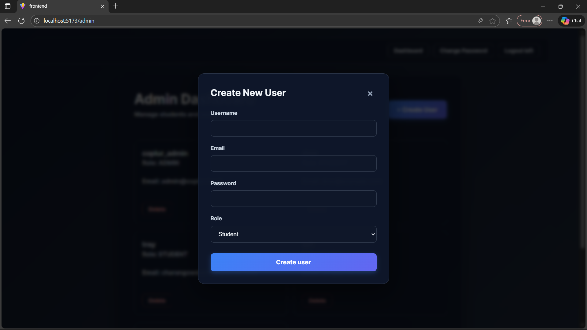
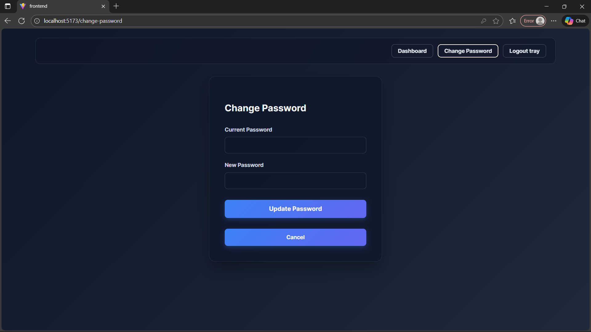

# Coplur Role-Based User Management

## Overview
This repository hosts a Django + DRF backend with SimpleJWT and a React + Vite frontend. Users are separated by `ADMIN` and `STUDENT` roles supported by middleware controls and protected pages.

## Backend (Django)
### Setup
```powershell
cd backend
python -m venv venv
venv\Scripts\activate
python -m pip install -r requirements.txt  # install Django, DRF, SimpleJWT, corsheaders
```
> If requirements.txt is missing, run `pip install django djangorestframework djangorestframework-simplejwt django-cors-headers mysqlclient` and add `pip freeze > requirements.txt`.

### Database
The project uses MySQL. Update `coplur/settings.py` with DB credentials if needed. After the database is reachable:
```powershell
venv\Scripts\python manage.py makemigrations
venv\Scripts\python manage.py migrate
venv\Scripts\python manage.py seed_admin
```
Default admin seeding arguments can be overridden via `--username`, `--email`, `--password`.

### Running the server
```powershell
venv\Scripts\python manage.py runserver
```
The backend will listen on `http://127.0.0.1:8000/` for the API endpoints.

## Frontend (React)
### Setup & run
```powershell
cd frontend
npm install
npm run dev -- --host
```
Use the Vite URL (typically `http://localhost:5173/`) to view the UI. The frontend hits the Django API via `http://localhost:8000/` with JWT tokens.

## Key APIs
| Endpoint | Method | Access | Description |
| --- | --- | --- | --- |
| `/api/accounts/register/` | POST | Public | Student registration. Returns 201.
| `/api/token/` | POST | Public | Returns access/refresh tokens for login.
| `/api/accounts/profile/` | GET | Authenticated | Returns user profile.
| `/api/accounts/admin/users/` | GET/POST | Admin | List/create users. POST accepts `username`, `email`, `password`, `role`.
| `/api/accounts/admin/users/{id}/` | DELETE | Admin | Delete a user.
| `/api/accounts/student/welcome/` | GET | Student | Welcome message for students.
| `/api/accounts/password/change/` | PUT | Authenticated | Change own password.

## Features implemented
- Custom `accounts.User` model with `ADMIN` and `STUDENT` roles.
- Role-enforcing permissions, JWT authentication, and CORS-safe API.
- Admin seeding command and dedicated user management views.
- React frontend with AuthContext, protected routes, login/register forms, admin dashboard, and student welcome page.
- Change Password functionality for authenticated users.
- Modern, clean UI with professional styling and responsive design.
- Modal-based user creation for admins.

## Admin credentials
After running `seed_admin`, default credentials are:
- **Username**: `coplur_admin`
- **Email**: `admin@coplur.local`
- **Password**: `ChangeMe@123`

## Running both servers
Start the backend first (see above). In a new terminal, start the frontend. Keep both running to enable the full experience.

## Screenshots

### Login Page


### Register Page


### Student Dashboard


### Admin Dashboard


### Create User Modal


### Change Password

